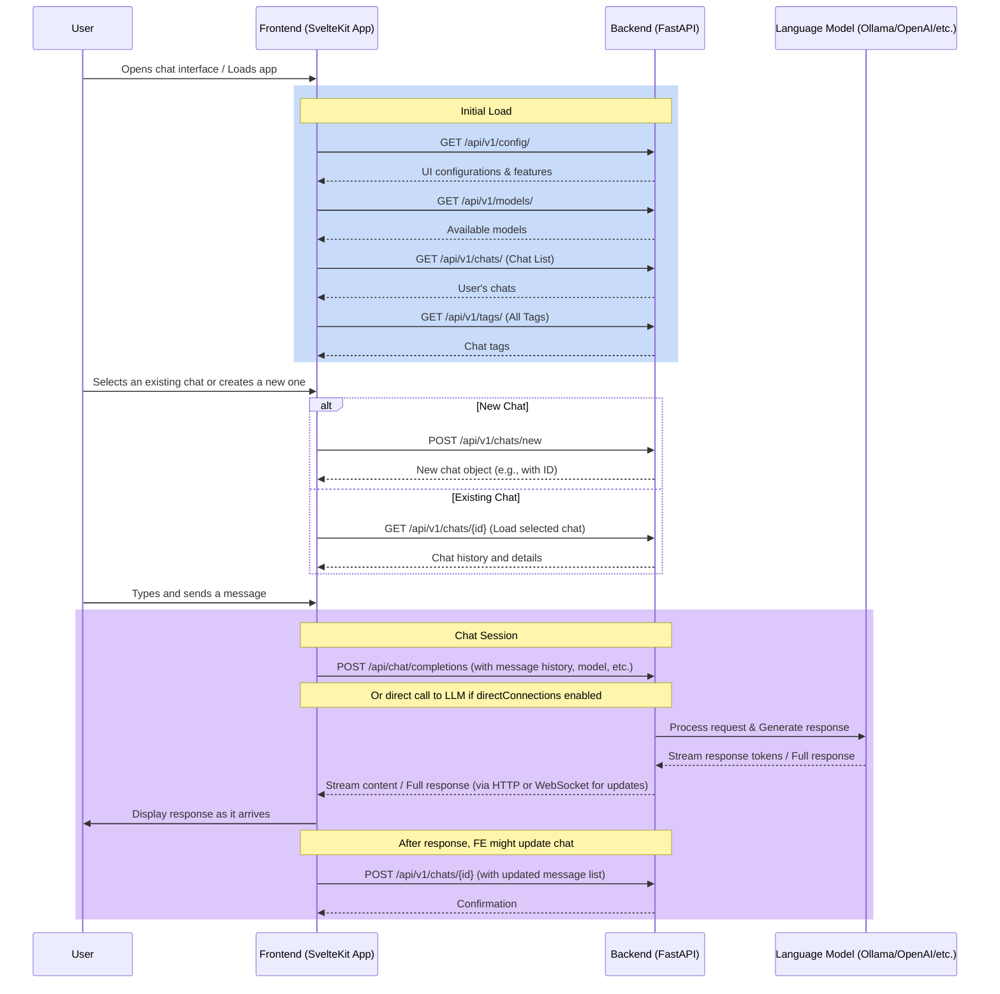
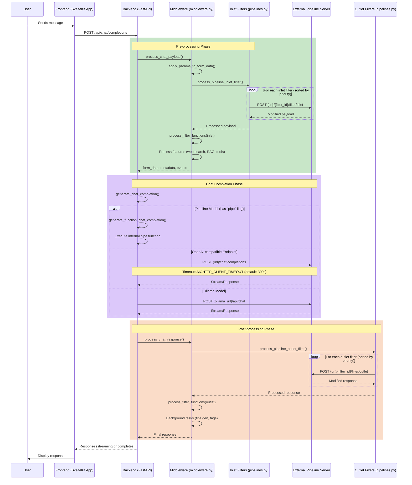
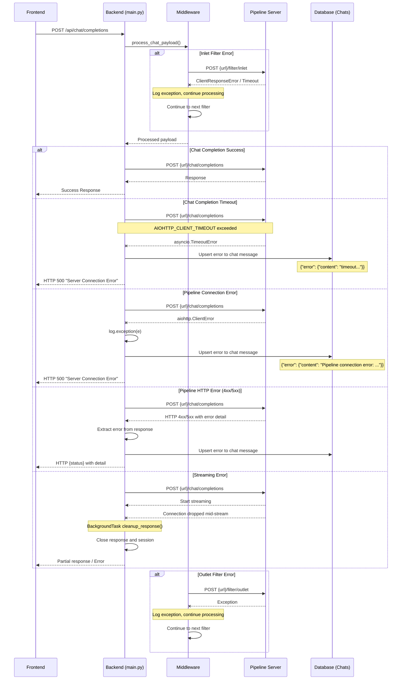
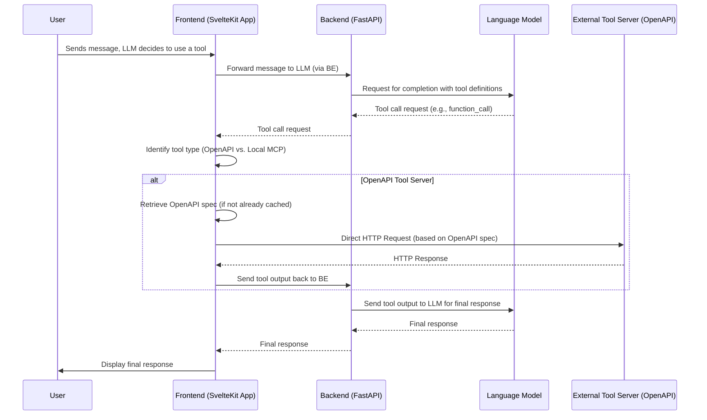
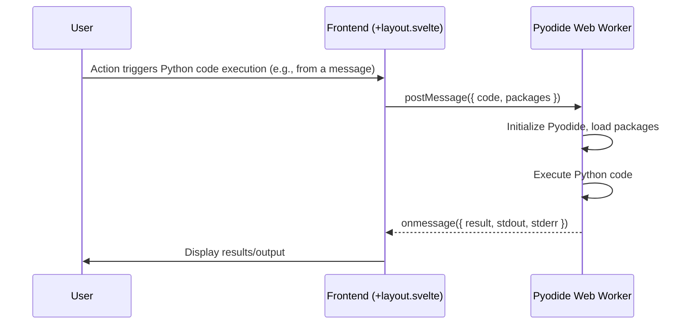
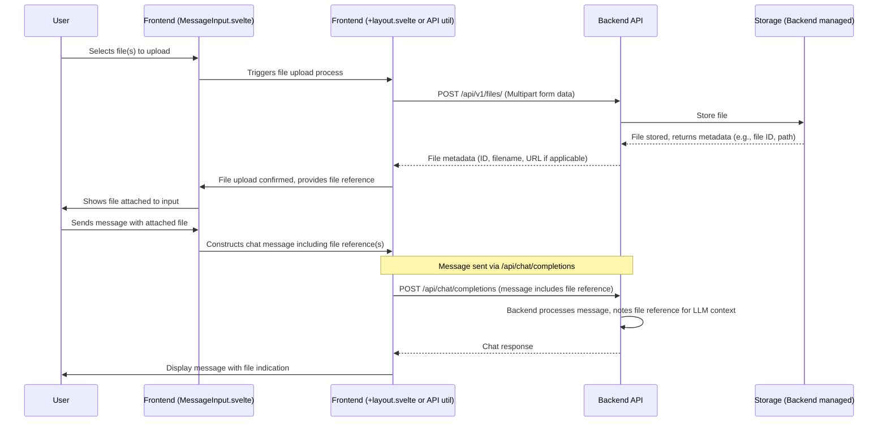

# Chat Flow Documentation

## Overview
This document describes the interaction flow between the frontend chat components, backend API endpoints, and external services like LLMs, Pipeline Servers, and Tool Servers in the OpenWebUI chat system.

## Architecture Overview

### Two Pipeline Mechanisms
Open WebUI supports **two different Pipeline mechanisms**:

| Mechanism | Condition | Connection Method | Code Location |
|-----------|-----------|-------------------|---------------|
| **Embedded Pipe Function** | `model.get("pipe") == True` | Direct function call | `chat.py:251` → `functions.py:137` |
| **External Pipeline Server** | `model.get("pipeline")` exists + `urlIdx` | HTTP request to external server | `openai.py:657-666` → `{url}/chat/completions` |

### Three-Segment HTTP Connection (NOT WebSocket)

The architecture uses **three HTTP connections**:

| Connection Segment | Protocol | Description |
|--------------------|----------|-------------|
| Frontend → Open WebUI Backend | HTTP POST + SSE | `fetch()` sends, `text/event-stream` returns |
| Open WebUI Backend → Pipeline Server | HTTP POST + SSE | `aiohttp` sends to `{pipeline_url}/chat/completions` |
| Pipeline Server → External Services | HTTP | Calls Azure OpenAI, Power BI API, JIRA, etc. |

**Note**: WebSocket (`/ws/socket.io`) is only used for "event push" - user online notifications, chat status updates (statusHistory), active model list. **Chat completion core data flow does NOT go through WebSocket**.

```
┌──────────┐         ┌──────────────┐         ┌─────────────────┐         ┌──────────────┐
│          │  HTTP   │              │  HTTP   │                 │  HTTP   │              │
│  Frontend │ ──────→ │ Open WebUI   │ ──────→ │ Pipeline Server │ ──────→ │ External     │
│  Browser  │ ←────── │   Backend    │ ←────── │  (Docker)       │ ←────── │ Services     │
│          │   SSE   │              │   SSE   │                 │  JSON   │ Azure/JIRA.. │
└──────────┘         └──────────────┘         └─────────────────┘         └──────────────┘
     │                      │                         │                          │
   Conn 1                 Conn 2                    Conn 3                  Various APIs
   (No timeout,         (AIOHTTP_CLIENT_          (Pipeline internal
    manual abort only)   TIMEOUT=1500s)            LLM timeouts)
```

### Complete Routing Path

```
POST /api/chat/completions
         │
         ↓
    generate_chat_completion() [chat.py:158]
         │
         ├─→ [model.get("pipe") == True]
         │        generate_function_chat_completion()
         │        Embedded Pipeline, direct function call
         │
         ├─→ [model.get("owned_by") == "arena"]
         │        Arena mode, randomly select model
         │
         ├─→ [model.get("owned_by") == "ollama"]
         │        generate_ollama_chat_completion()
         │
         └─→ [Default - includes external Pipeline Server]
                  generate_openai_chat_completion() [openai.py:588]
                       │
                       │  if "pipeline" in model:  [line 658]
                       │      Add user info to payload
                       │
                       └─→ POST {OPENAI_API_BASE_URLS[idx]}/chat/completions
                           ★ External Pipeline Server called here ★
```

## Frontend Components
Located in `src/lib/components/chat/` and related areas:

### Main Chat Interface Components
- **`Chat.svelte`**: Main chat container, orchestrates the chat experience. (Typically rendered by `src/routes/(app)/+page.svelte`)
- **`Messages.svelte`**: Displays the list of chat messages.
- **`MessageInput.svelte`**: User input area for composing messages, handling attachments, and triggering send.
- **`ChatControls.svelte`**: Contains action buttons relevant to the current chat (e.g., regenerate, copy, edit).
- **`ModelSelector.svelte`**: Allows users to select the AI model for the conversation.
- **`src/routes/+layout.svelte`**: Handles global aspects like WebSocket connections, Python code execution via Pyodide, and orchestrating calls to Tool Servers.

### Modals & Feature Components
- **`TagChatModal.svelte`**: For adding/editing tags associated with a chat.
- **`ShareChatModal.svelte`**: For generating a shareable link for a chat.
- **`SettingsModal.svelte`**: For user-specific and application-wide settings.
- **`ToolServersModal.svelte`**: Interface for users to configure connections to external Tool Servers.
- **File Upload**: Integrated into `MessageInput.svelte`, interacts with `POST /api/v1/files/`.

## Backend API Endpoints (Primarily from `backend/open_webui/routers/`)

Base path for most APIs: `/api/v1/`

### Configuration & General
- `GET /api/v1/config/`: Load UI and backend feature configurations.
- `GET /api/v1/models/`: Get list of all available/configured AI models.
- `GET /api/v1/tags/`: Get all unique tags used across chats.

### Chat Management (`chats.py`)
- `GET /api/v1/chats/`: Get user's chat list (can include filters for pinned, archived, folder_id).
- `POST /api/v1/chats/new`: Create a new chat session.
- `GET /api/v1/chats/{id}`: Get a specific chat by its ID.
- `POST /api/v1/chats/{id}`: Update a chat (e.g., its content, title, folder_id, archived status).
- `DELETE /api/v1/chats/{id}`: Delete a chat.

### Chat Features (`chats.py`)
- `POST /api/v1/chats/{id}/share`: Create a shareable link for a chat.
- `DELETE /api/v1/chats/{id}/share`: Remove a shareable link for a chat.
- `GET /api/v1/chats/share/{share_id}`: Access a publicly shared chat (implementation detail, actual endpoint might vary).
- `POST /api/v1/chats/{id}/tags`: Add a tag to a chat.
- `DELETE /api/v1/chats/{id}/tags/{tag_name}`: Remove a tag from a chat.
- `POST /api/v1/chats/{id}/pin`: Pin/unpin a chat.
- `POST /api/v1/chats/{id}/clone`: Clone an existing chat.
- `POST /api/v1/chats/{id}/archive`: Archive/unarchive a chat.

### LLM Interaction & Generation
- `POST /api/chat/completions`: Main endpoint for generating chat completions, handled in `main.py` and delegating to `open_webui.utils.chat`.
- Frontend can also make direct calls to OpenAI-compatible APIs if `directConnections` are configured in user settings (handled in `src/routes/+layout.svelte`).
- Ollama-specific (from `ollama.py` if Ollama is enabled):
    - `GET /api/tags`: Get Ollama-specific models.
    - `POST /api/chat`: Ollama-specific chat completion.
    - `POST /api/generate`: Ollama-specific text generation.
    - `POST /api/embeddings`: Ollama-specific embeddings generation.

### File Management (`files.py`)
- `POST /api/v1/files/`: Upload a new file.
- `GET /api/v1/files/`: List user's uploaded files.
- `GET /api/v1/files/{id}/content`: Download/access file content.

## Timeout Configuration

OpenWebUI uses configurable timeouts for various operations, defined in `backend/open_webui/env.py`:

| Environment Variable | Default | Description |
|---------------------|---------|-------------|
| `AIOHTTP_CLIENT_TIMEOUT` | `None` (no timeout) or `300` seconds | Chat completion requests to LLM/Pipeline servers |
| `AIOHTTP_CLIENT_TIMEOUT_MODEL_LIST` | `10` seconds | Model list fetching from pipeline/LLM servers |
| `AIOHTTP_CLIENT_TIMEOUT_TOOL_SERVER_DATA` | `10` seconds | Tool server data requests |

**Note**: Inlet/Outlet filter requests currently use default aiohttp timeout (no explicit timeout set).

### Complete Timeout Chain

```
Frontend (No timeout - manual AbortController only)
    │
    │ Connection 1
    ↓
Open WebUI Backend
    │  AIOHTTP_CLIENT_TIMEOUT = 1500 seconds (docker-compose.yml setting)
    │
    │ Connection 2
    ↓
Pipeline Server
    │  LLM timeout = 400-500 seconds
    │  Power BI DAX = 120 seconds
    │  Device Flow = ~15 minutes (MSAL expires_in=900)
    │
    │ Connection 3
    ↓
External Services (Azure OpenAI, Power BI, JIRA...)
```

### Detailed Timeout Settings

| Location | Environment Variable/Setting | Default Value | File & Line |
|----------|------------------------------|---------------|-------------|
| **Connection 1: Frontend** | None | **No Timeout!** | `openai/index.ts:332-359` |
| **Connection 2: Backend HTTP** | `AIOHTTP_CLIENT_TIMEOUT` | **1500 seconds** (docker-compose.yml) | `env.py:439-447` |
| **Connection 2: Backend Model List** | `AIOHTTP_CLIENT_TIMEOUT_MODEL_LIST` | 10 seconds | `env.py:449-460` |
| **Connection 3: Pipeline LLM (gpt-4.1)** | Hardcoded | `timeout=500` seconds | `llamaindex...py:172` |
| **Connection 3: Pipeline Orchestrator** | Hardcoded | `timeout=400` seconds | `llamaindex...py:205` |
| **Connection 3: Pipeline Gemini** | Hardcoded | `timeout=500` seconds | `llamaindex...py:184` |
| **Connection 3: Power BI DAX** | Hardcoded | `timeout=120` seconds | `powerbi_client.py:446` |
| **Connection 3: Power BI Device Flow** | MSAL Default | ~15 minutes (expires_in=900) | `powerbi_client.py:410` |

### Frontend Timeout Behavior

The frontend has **no timeout handling mechanism**:

```typescript
// src/lib/apis/openai/index.ts:332-359
export const chatCompletion = async (...) => {
    const controller = new AbortController();  // Only AbortController
    const res = await fetch(`${url}/chat/completions`, {
        signal: controller.signal,  // For manual abort, no timeout
        method: 'POST',
        ...
    });
    return [res, controller];  // Returns controller for external manual abort
};
```

- `fetch()` API itself does not support timeout parameter
- `AbortController` is only used for manual abort (e.g., user clicks stop button)
- No `AbortSignal.timeout()` or other automatic timeout mechanism
- **If backend or Pipeline is unresponsive for a long time, frontend will wait indefinitely**

### Environment Variable Processing

```python
# env.py:439-447
AIOHTTP_CLIENT_TIMEOUT = os.environ.get("AIOHTTP_CLIENT_TIMEOUT", "")

if AIOHTTP_CLIENT_TIMEOUT == "":
    AIOHTTP_CLIENT_TIMEOUT = None  # If not set, None (infinite wait)
else:
    try:
        AIOHTTP_CLIENT_TIMEOUT = int(AIOHTTP_CLIENT_TIMEOUT)
    except Exception:
        AIOHTTP_CLIENT_TIMEOUT = 300  # Conversion failure defaults to 300 seconds
```

## Window Refresh / Initial Load API Flow
1.  **Load Configuration & Models:**
    *   `FE -> BE: GET /api/v1/config/` (Loads essential UI configurations and feature flags)
    *   `FE -> BE: GET /api/v1/models/` (Fetches list of available AI models)
2.  **Load User-Specific Chat Data (after authentication):**
    *   `FE -> BE: GET /api/v1/chats/` (Loads user's chat list, including pinned status)
    *   `FE -> BE: GET /api/v1/tags/` (Loads all unique chat tags for filtering)
4.  **If Navigating to an Existing Chat:**
    *   `FE -> BE: GET /api/v1/chats/{id}` (Loads the content of the specific chat)

## Interaction Flows

### Chat Initialization & Message Sending Flow



### External Pipeline Server Chat Completion Flow

This flow describes the complete path when using external pipeline servers for model calls.



### Detailed Backend Request Flow

```
Frontend
  │
  ▼
/api/chat/completions (main.py:1079-1172)
  │
  ▼
process_chat_payload (middleware.py:685-951)
  ├── apply_params_to_form_data()
  ├── process_pipeline_inlet_filter (pipelines.py:60-106)
  │   └── POST to {url}/{filter_id}/filter/inlet
  ├── process_filter_functions (filter.py) [inlet]
  └── process_chat_completion_tools_handler
      └── generate_chat_completion (utils/chat.py:158-281)
         ├── generate_openai_chat_completion (routers/openai.py:589-780)
         │   └── POST to {url}/chat/completions
         ├── generate_ollama_chat_completion (routers/ollama.py)
         │   └── POST to {ollama_url}/api/chat
         └── generate_function_chat_completion (functions.py:137-324)
             └── Execute internal pipe function
  │
  ▼
process_chat_response (middleware.py:954-1000+)
  ├── process_pipeline_outlet_filter (pipelines.py:109-158)
  │   └── POST to {url}/{filter_id}/filter/outlet
  ├── process_filter_functions (filter.py) [outlet]
  └── Background tasks (title generation, tags, webhooks)
  │
  ▼
Return to Frontend
```

### Exception and Timeout Flow

This diagram shows how errors and timeouts are handled throughout the chat completion flow.



### Exception Handling Details

#### Error Types and Handling Locations

| Error Type | Location | Handling Behavior |
|------------|----------|-------------------|
| `aiohttp.ClientError` | `openai.py:749-774` | Log, persist to DB, raise HTTP 500 |
| `aiohttp.ClientResponseError` | `pipelines.py:95-102` | Log, extract detail, may continue |
| `asyncio.TimeoutError` | `openai.py` (via aiohttp) | Treated as ClientError, HTTP 500 |
| Pipeline HTTP 4xx/5xx | `openai.py:730-748` | Extract detail from response, propagate status |
| Internal Function Error | `functions.py:137-324` | Return error in response body, no propagation |

#### Error Persistence to Database

When chat completion fails, errors are persisted for user visibility:

```python
# Location: openai.py:760-768
if metadata and metadata.get("chat_id") and metadata.get("message_id"):
    error_message = str(e)
    if isinstance(e, aiohttp.ClientError):
        error_message = f"Pipeline connection error: {str(e)}"

    Chats.upsert_message_to_chat_by_id_and_message_id(
        metadata["chat_id"],
        metadata["message_id"],
        {"error": {"content": error_message}},
    )
```

#### Streaming Response Cleanup

For streaming responses, resources are cleaned up even on error:

```python
# Location: openai.py:714-720
return StreamingResponse(
    r.content,
    status_code=r.status,
    headers=dict(r.headers),
    background=BackgroundTask(cleanup_response, response=r, session=session),
)
```

### Filter Pipeline Behavior

#### Inlet Filters (`pipelines.py:60-106`)
- Filters are sorted by `model["pipeline"]["priority"]`
- Can target specific models or all models using `pipelines: ["*"]`
- **Exception Behavior**: Errors are logged but do NOT break the pipeline chain
- Processing continues to next filter even if one fails

#### Outlet Filters (`pipelines.py:109-158`)
- Similar behavior to inlet filters
- Process after chat completion response is received
- **Exception Behavior**: Same as inlet - logged, but continues processing

### Pipeline Server Internal Execution Flow

```
Pipeline Server receives POST /chat/completions
         │
         ↓
Pipeline.pipe() is called  [line 286]
         │
         ↓
┌─────────────────────────────────────────────────────────────────┐
│  _iterate_async_gen_in_sync()  [pipeline_modules/utils.py]      │
│                                                                 │
│  ┌───────────────────────────────────────────────────────────┐  │
│  │  Main Thread                                               │  │
│  │                                                           │  │
│  │  thread_queue = queue.Queue()                             │  │
│  │                                                           │  │
│  │  while True:                                              │  │
│  │      item = thread_queue.get()  ← Blocking wait          │  │
│  │      if item is None: break                               │  │
│  │      yield item  ← Return to Pipeline Server              │  │
│  │                                                           │  │
│  └────────────────────────┬──────────────────────────────────┘  │
│                           │                                     │
│                           │  queue.put()                        │
│                           │                                     │
│  ┌────────────────────────┴──────────────────────────────────┐  │
│  │  Background Thread (daemon=True)                          │  │
│  │                                                           │  │
│  │  asyncio.run(_run_async_in_context())                     │  │
│  │                                                           │  │
│  │      async for chunk in async_gen:                        │  │
│  │          thread_queue.put(chunk)                          │  │
│  │                                                           │  │
│  │      thread_queue.put(None)  ← End signal                 │  │
│  │                                                           │  │
│  └───────────────────────────────────────────────────────────┘  │
│                                                                 │
└─────────────────────────────────────────────────────────────────┘
         │
         ↓
Pipeline Server converts yielded content to SSE format and returns
```

**Key Design Points:**
- **Main Thread**: Uses `queue.Queue.get()` to block wait for data
- **Background Thread**: `thread.daemon = True`, runs `asyncio` event loop
- **Communication**: Data is passed between two threads via `queue.Queue`
- **End Signal**: Background thread `put(None)` to notify main thread when done

## Problem Scenario Analysis

### Scenario 1: Frontend Timeout / Disconnect, Backend Continues

```
     Time ─────────────────────────────────────────────────────────────────→

     Frontend           Open WebUI Backend         Pipeline Server
        │                     │                       │
     t0 │ ── HTTP POST ─────→ │ ── HTTP POST ───────→ │
        │                     │                       │
     t1 │ (waiting...)        │ (waiting...)          │ (executing agents...)
        │                     │                       │
     t2 │ ╳ User closes       │                       │
        │   browser or        │                       │
        │   network drops     │                       │
        │                     │                       │
        │ (Connection 1 lost) │                       │
        │                     │ ← SSE chunk ─────────│
        │                     │                       │
        │                     │ ★ Attempts to write  │
        │                     │   to closed conn 1 ★ │
        │                     │                       │
        │                     │   But conn 2 still   │
        │                     │   valid, Pipeline    │
        │                     │   continues          │
        │                     │                       │
        ▼                     ▼                       ▼
    User doesn't         ★ Saves received        Continues consuming
    know final result       content ★               resources
```

**Root Causes:**
1. **Frontend has no explicit timeout** (only manual abort)
2. **Connection 1 and 2 are independent** - Connection 1 dropping doesn't automatically interrupt Connection 2
3. **Pipeline Server cannot sense frontend state** - No Cancellation Token mechanism

### Scenario 2: Any Segment Connection Drops

```
Scenario A: Connection 2 drops (Open WebUI Backend ↔ Pipeline Server)
────────────────────────────────────────────────────────
     Frontend         Open WebUI Backend        Pipeline Server
        │                   │                      │
     t0 │ ─ POST ─────────→ │ ─ POST ────────────→ │
        │                   │                      │
     t1 │ (waiting...)      │ (waiting...)         │ (executing...)
        │                   │                      │
     t2 │                   │ ╳ Conn 2 drops       │
        │                   │   (network/timeout)  │
        │                   │                      │
        │ ← HTTP 500 ───────│                      │ (may continue)
        ▼                   ▼                      ▼
    Show error          Log error              Unaware to stop


Scenario B: Connection 3 drops (Pipeline Server ↔ External Service)
────────────────────────────────────────────────────────
     Pipeline Server            External Service (Azure OpenAI)
           │                           │
        t0 │ ── HTTP ────────────────→ │
           │                           │
        t1 │ ╳ Conn 3 drops            │
           │   (network/timeout)       │
           │                           │
           │ ← Exception ──────────────│
           │                           │
           │ (Exception propagates up) │
           ▼                           ▼
      Stop and report error        Unaware
```

**Root Cause:** Three connections are independent, no unified error propagation mechanism, no Cancellation Token pattern implemented.

### Scenario 3: Power BI Authentication Failure (★ Core Issue ★)

```
     Time ─────────────────────────────────────────────────────────────────→

     Frontend     Open WebUI Backend    Pipeline Server           MSAL
        │               │                  │                    │
     t0 │ ── POST ────→ │ ── POST ───────→ │                    │
        │               │                  │                    │
     t1 │ (waiting...)  │ (waiting...)     │ ─ _get_token() ──→ │
        │               │                  │                    │
        │               │                  │                    │ Try silent
        │               │                  │                    │ ← Failed
        │               │                  │                    │
     t2 │ ╔═════════════╪══════════════════╪════════════════════╪═══════════════╗
        │ ║ Enters Device Flow authentication mode                             ║
        │ ║                                                                    ║
        │ ║ powerbi_client.py:400-410                                          ║
        │ ║   flow = app.initiate_device_flow(scopes=POWERBI_SCOPES)           ║
        │ ║   self._notifier.send_slack_notification(flow, ...)  ← Send Slack  ║
        │ ║   result = app.acquire_token_by_device_flow(flow)    ← ★ BLOCKS! ★ ║
        │ ║                                                                    ║
        │ ║ MSAL waits for user to complete auth (default ~15 minutes)        ║
        │ ║ But this wait happens in Pipeline Server thread                    ║
        │ ║ Frontend has no idea what's happening, only sees loading           ║
        │ ╚════════════════════════════════════════════════════════════════════╝
        │               │                  │                    │
     t3 │ (spinning...) │ (waiting...)     │ (blocked in MSAL)  │ (waiting auth)
        │               │                  │                    │
   t∞   │ User gives up │                  │                    │
        │ closes page   │                  │                    │
        ▼               ▼                  ▼                    ▼
```

**★ This is the root cause of "BI auth failure causing program to wait in console"! ★**

**Problem Explanation:**
1. When Power BI Refresh Token expires (90-day limit)
2. `acquire_token_silent()` fails
3. Program enters Device Flow authentication mode
4. `acquire_token_by_device_flow(flow)` **blocks waiting** until:
   - User completes authentication (but user is waiting on frontend, can't see Slack notification)
   - Or wait times out (default ~15 minutes, controlled by `expires_in=900`)
5. During this time no output to frontend, user only sees loading

### Timeout Order Relationship

Based on current settings:

| Location | Timeout Value | Description |
|----------|--------------|-------------|
| Frontend | Infinite | User can only cancel manually |
| Backend → Pipeline | 1500 seconds (25 min) | AIOHTTP_CLIENT_TIMEOUT |
| MSAL Device Flow | ~900 seconds (15 min) | expires_in default |

**Actual Flow (When Power BI auth fails):**
1. t=0: User initiates request
2. t=0~15 min: MSAL blocks waiting for Device Flow
3. t≈15 min: MSAL times out, throws RuntimeError
4. Pipeline catches error, returns error message to backend
5. Backend returns error to frontend
6. Frontend displays error message

**In this flow, backend's 1500-second timeout won't trigger because MSAL times out first.**

## Backend Error Recording Mechanism

### Streaming Cancellation - Content Saved

When streaming is cancelled midway, already-received content is saved:

```python
# middleware.py:2237-2249
except asyncio.CancelledError:
    log.warning("Task was cancelled!")
    await event_emitter({"type": "task-cancelled"})

    if not ENABLE_REALTIME_CHAT_SAVE:
        # Save message in the database
        Chats.upsert_message_to_chat_by_id_and_message_id(
            metadata["chat_id"],
            metadata["message_id"],
            {
                "content": serialize_content_blocks(content_blocks),
            },
        )
```

### Real-time Save Setting

```python
# env.py:354-355
ENABLE_REALTIME_CHAT_SAVE = (
    os.environ.get("ENABLE_REALTIME_CHAT_SAVE", "False").lower() == "true"
)
```

| Setting | Behavior |
|---------|----------|
| `False` (default) | Only saves after streaming ends or when CancelledError occurs |
| `True` | Saves to database immediately with each chunk received |

### Can User See Records When Returning to Conversation?

**Conclusion: Yes, users can see them.**

The save mechanism writes to database via `Chats.upsert_message_to_chat_by_id_and_message_id()`:
- On normal completion: Saves complete `content`
- On cancellation: Saves **already-received partial content** (`content_blocks`)
- On error: Saves `{"error": {"content": error_message}}`

When user returns to conversation via URL, these records are loaded from database:
1. Can see partial content already returned by Pipeline
2. Can see error messages (if any)
3. Can know the last state of the conversation

### Tool Execution Flow (Unified)
This flow describes how tools are executed, differentiating between external (backend-proxied) and local (frontend-direct) tool servers.


### Custom Python Tool Execution Flow (via Pyodide Worker)
This flow describes when frontend executes Python code using the integrated Pyodide worker.


### File Upload Flow


## Chat Window Components (Key Areas)

### Main Interface Structure
- **Sidebar (`AppSidebar.svelte` or similar):** Navigation for chat history, new chat, access to folders, tags, settings, etc.
- **Chat View Area:**
    - **Model Selector/Header:** Displays current model, options to change model, chat-specific actions.
    - **Message Display Area (`Messages.svelte`):** Shows the conversation history, including user messages, AI responses, and tool outputs.
    - **Input Area (`MessageInput.svelte`):** Text input field with support for attachments (files), rich text formatting, and sending messages.

### Core Action Buttons/Features
- **New Chat:** Initiates a new conversation session.
- **Send Message:** Submits the current input to the selected AI model.
- **Model Selection:** Allows changing the underlying language model.
- **File Upload:** Attach files to be included in the chat context or processed by tools.
- **Settings Access:** Opens modals for user, chat, or application settings.

### Tool & Function Integration
- **Code Execution:** Allows running Python code snippets within the chat (via Pyodide). Results are displayed back.
- **External Tool Servers:** Connects to and utilizes pre-configured external tools.
- **Knowledge Base Access:** (If RAG is enabled) Allows chat to reference documents from integrated knowledge bases.

### Organization & Management Features
- **Folders:** Group related chats for better organization.
- **Tags:** Label conversations with custom tags for easy filtering and identification.
- **Search:** Functionality to search through chat history or titles.
- **Pin/Archive/Delete:** Standard chat management actions.
- **Share Chat:** Generate shareable links for conversations.

## Pipeline Server Configuration

### External Pipeline Server Setup
Pipeline servers are configured via OpenAI-compatible API base URLs and keys:

```python
# API Configuration (from config)
OPENAI_API_BASE_URLS[urlIdx]  # Base URL for pipeline server
OPENAI_API_KEYS[urlIdx]       # API key for authentication
```

### User Info Headers (Optional)
When `ENABLE_FORWARD_USER_INFO_HEADERS` is enabled, user context is forwarded to pipeline servers:

```python
headers = {
    "X-OpenWebUI-User-Name": user.name,
    "X-OpenWebUI-User-Id": user.id,
    "X-OpenWebUI-User-Email": user.email,
    "X-OpenWebUI-User-Role": user.role,
}
```

### Pipeline Types

| Type | Location | Description |
|------|----------|-------------|
| **Filter Pipeline** | External server | Processes payloads before/after completion (inlet/outlet) |
| **Pipe Function** | Internal (functions.py) | Python function with `pipe` flag, executed locally |
| **OpenAI-compatible** | External server | Standard chat/completions endpoint |
| **Ollama** | External server | Ollama-specific API format |

## Key Source Files Reference

### Frontend (SvelteKit/TypeScript)

| File Path | Function | Key Functions/Blocks |
|-----------|----------|---------------------|
| `src/lib/components/chat/Chat.svelte` | Main chat component | `sendPrompt()` :1398<br>`sendPromptSocket()` :1531<br>`stopResponse()` :1769 |
| `src/lib/apis/openai/index.ts` | OpenAI API client | `chatCompletion()` :332-359 |
| `src/lib/apis/streaming/index.ts` | SSE streaming parser | `createOpenAITextStream()` :28<br>`openAIStreamToIterator()` :43 |
| `src/lib/apis/index.ts` | General API functions | `chatCompleted()` :159<br>`stopTask()` :231 |

### Backend - Open WebUI (FastAPI Python)

| File Path | Function | Key Functions/Classes |
|-----------|----------|----------------------|
| `backend/open_webui/main.py` | API entry point | `@app.post("/api/chat/completions")` :1079 |
| `backend/open_webui/utils/chat.py` | Chat routing | `generate_chat_completion()` :158<br>Routing decision :203-280 |
| `backend/open_webui/routers/openai.py` | OpenAI/Pipeline routing | `generate_chat_completion()` :588<br>Pipeline identification :657-666<br>HTTP request sending :696-750 |
| `backend/open_webui/routers/pipelines.py` | Pipeline Filter handling | `process_pipeline_inlet_filter()` :60<br>`process_pipeline_outlet_filter()` :109 |
| `backend/open_webui/functions.py` | Embedded Pipe execution | `generate_function_chat_completion()` :137 |
| `backend/open_webui/utils/middleware.py` | Middleware processing | `process_chat_payload()` :771 calls inlet filter |
| `backend/open_webui/socket/main.py` | WebSocket events | `get_event_emitter()` :302 |
| `backend/open_webui/env.py` | Environment config | `AIOHTTP_CLIENT_TIMEOUT` :439 |

### Pipeline Server

| File Path | Function | Key Functions/Classes |
|-----------|----------|----------------------|
| **Official Pipeline Server** (from ghcr.io/open-webui/pipelines) |||
| `main.py` | Server entry | FastAPI app, loads /pipelines directory |
| **Custom Pipeline Modules** |||
| `llamaindex_pipeline_v6.1_SPA_Chief_Planner_modularized.py` | Main entry | `class Pipeline`<br>`pipe()` :286<br>`_async_pipe_logic()` :261 |
| `pipeline_modules/utils.py` | Utility functions | `_iterate_async_gen_in_sync()`<br>`stream_handler_context` |
| `pipeline_modules/agents/orchestrator_agent_workflow.py` | Orchestrator Agent | `run_orchestrator_workflow()` |
| `pipeline_modules/agents/search_plan_agent_workflow.py` | Planner Agent | `SearchPlanAgent` |
| `pipeline_modules/agent_registry.py` | Agent Registry | `AgentRegistry` |
| `pipeline_modules/streaming.py` | Streaming support | `StreamingContext`<br>`StreamingWorkflow` |
| `pipeline_modules/events.py` | Event definitions | `ThoughtStreamEvent`<br>`ProgressStreamEvent` |
| `pipeline_modules/agents/PowerBI/powerbi_client.py` | Power BI client | `PowerBIAPIClient`<br>`_get_token()` :375-418<br>`execute_dax_query()` :442 |

### Summary Table

| Step | Description | File Location |
|------|-------------|---------------|
| 1. Entry | Frontend → `POST /api/chat/completions` | `main.py:1079` |
| 2. Pre-processing | `process_pipeline_inlet_filter()` optionally calls pipeline's `/filter/inlet` | `pipelines.py:88-93` |
| 3. Routing Decision | Choose handler based on model type | `chat.py:251-280` |
| 4. External Request | Send `POST {pipeline_url}/chat/completions` to external pipeline | `openai.py:700-702` |
| 5. Post-processing | `process_pipeline_outlet_filter()` optionally calls pipeline's `/filter/outlet` | `pipelines.py:137-138` |
| 6. Response | Return pipeline response (streaming or JSON) to frontend | `main.py:1165` |
